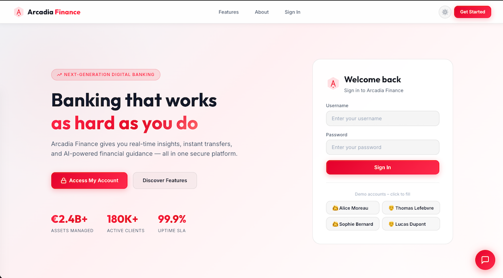
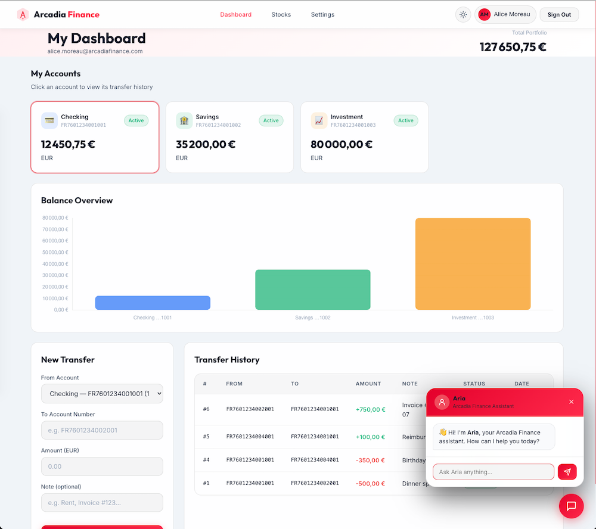
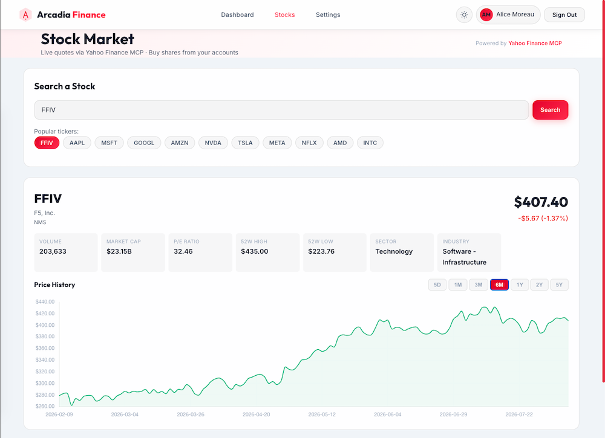

# 🏦 Arcadia Finance 3.0 – F5 Security Demo Application

> **⚠️ WARNING: This application is intentionally vulnerable. It is designed exclusively for F5 WAF/security demonstration purposes. NEVER deploy in production.**







---

## 🚀 Quick Start

```bash
git clone <repo>
cd demo-app-f5-2026-claude
docker compose up --build
```

Open **http://localhost:8080** in your browser.

---

## 🐳 Docker Architecture (4 services)

| Service | Container | Port | Role |
|---|---|---|---|
| **db** | `arcadia-db` | 3306 | MySQL 8 — all persistent data, auto-seeded |
| **main-app** | `arcadia-main` | 8080 | Flask — serves frontend + API (auth, accounts, config, chat, proxy to transfer-service & stock-service) |
| **transfer-service** | `arcadia-transfer` | 8081 (internal) | Flask — dedicated money-transfer microservice |
| **stock-service** | `arcadia-stock` | 8082 (internal) | Flask — stock quotes & purchases, wraps the Yahoo Finance MCP server |

All browser traffic goes through **main-app** on port **8080** only.

> ⚠️ **First run or schema changes:** the database uses a persistent Docker named volume (`db_data`). If you need to recreate the schema (e.g. to add the new `stock_holdings` / `stock_orders` tables), run:
> ```bash
> docker compose down -v   # destroys the volume — all data is lost
> docker compose up --build
> ```

> 🌐 **Internet access required:** `stock-service` fetches live data from Yahoo Finance at demo time. The container must have outbound internet connectivity.

---

## 👤 Demo Users

| Name | Username | Password |
|---|---|---|
| Alice Moreau | `alice` | `alice123` |
| Thomas Lefebvre | `thomas` | `thomas123` |
| Sophie Bernard | `sophie` | `sophie123` |
| Lucas Dupont | `lucas` | `lucas123` |

---

## 🔐 JWT Authentication — API Usage (Postman / curl)

All private API endpoints require a valid JWT Bearer token. Tokens are issued by the app itself (HS256, 8-hour expiry) — no external OAuth server needed.

### Step 1 — Obtain a token

```bash
curl -s -X POST http://localhost:8080/api/token \
  -H "Content-Type: application/json" \
  -d '{"username": "alice", "password": "alice123"}'
```

**Response:**
```json
{
  "access_token": "eyJhbGciOiJIUzI1NiIsInR5cCI6IkpXVCJ9...",
  "token_type": "bearer",
  "expires_in": 28800,
  "user": {
    "id": 1,
    "name": "Alice",
    "surname": "Moreau",
    "email": "alice.moreau@arcadiafinance.com",
    "username": "alice"
  }
}
```

### Step 2 — Call protected endpoints

Pass the token in the `Authorization: Bearer` header on every subsequent request.

**Get current user profile:**
```bash
curl -s http://localhost:8080/api/me \
  -H "Authorization: Bearer <access_token>"
```

**List accounts:**
```bash
curl -s http://localhost:8080/api/accounts \
  -H "Authorization: Bearer <access_token>"
```

**Get transfer history for an account:**
```bash
curl -s "http://localhost:8080/api/transfers?account=FR7601234001001" \
  -H "Authorization: Bearer <access_token>"
```

**Execute a transfer:**
```bash
curl -s -X POST http://localhost:8080/api/transfer \
  -H "Content-Type: application/json" \
  -H "Authorization: Bearer <access_token>" \
  -d '{
    "from_account": "FR7601234001001",
    "to_account":   "FR7601234002001",
    "amount":       250.00,
    "note":         "Invoice #42"
  }'
```

### Postman Quick Setup

1. Send `POST http://localhost:8080/api/token` with the JSON body above.
2. Copy the `access_token` value from the response.
3. In any subsequent request, go to **Authorization → Bearer Token** and paste the token.
4. Alternatively, use a **Collection Variable** + a **Post-response Script** to capture it automatically:

```js
// Postman Post-response script on the /api/token request
const token = pm.response.json().access_token;
pm.collectionVariables.set("jwt_token", token);
```

Then set `Authorization → Bearer Token` to `{{jwt_token}}` on every protected request in the collection.

### Protected endpoints summary

| Method | Endpoint | Description |
|--------|----------|-------------|
| `POST` | `/api/token` | 🔓 **Public** — exchange credentials for JWT |
| `POST` | `/api/login` | 🔓 **Public** — browser login (sets cookie + returns JWT) |
| `POST` | `/api/logout` | 🔓 **Public** — clears session |
| `GET`  | `/api/me` | 🔒 Authenticated user profile |
| `GET`  | `/api/users` | 🔒 List all users |
| `GET`  | `/api/users/{id}` | 🔒 Get user by ID ⚠️ BOLA vulnerability |
| `GET`  | `/api/accounts` | 🔒 User's bank accounts |
| `GET`  | `/api/transfers?account=` | 🔒 Transfer history |
| `POST` | `/api/transfer` | 🔒 Execute a money transfer |
| `GET`  | `/api/config` | 🔒 LLM configuration |
| `POST` | `/api/config` | 🔒 Save LLM configuration |
| `POST` | `/api/chat` | 🔒 Chat with Aria (LLM proxy) |
| `GET`  | `/api/stocks/quote?ticker=` | 🔒 Live stock quote |
| `GET`  | `/api/stocks/history?ticker=` | 🔒 Historical OHLCV price data |
| `GET`  | `/api/stocks/search?q=` | 🔒 Validate / look up a ticker |
| `GET`  | `/api/stocks/portfolio` | 🔒 Current user's stock holdings |
| `GET`  | `/api/stocks/orders` | 🔒 Current user's stock order history |
| `POST` | `/api/stocks/buy` | 🔒 Purchase shares (debits a bank account) |

> **Note:** The web browser automatically attaches the JWT (stored in `localStorage`) to every API call via the `Authorization: Bearer` header — no extra configuration needed.

---

## 📈 Stock Market — API Usage (curl / Postman)

All stock endpoints go through **main-app** (`http://localhost:8080`). The JWT obtained in Step 1 above is reused for all calls.

### Get a live quote

```bash
curl -s "http://localhost:8080/api/stocks/quote?ticker=AAPL" \
  -H "Authorization: Bearer <access_token>"
```

**Response:**
```json
{
  "ticker": "AAPL",
  "name": "Apple Inc.",
  "price": 213.49,
  "currency": "USD",
  "exchange": "NMS",
  "change": 1.23,
  "change_pct": 0.58,
  "market_cap": 3280000000000,
  "pe_ratio": 33.4,
  "volume": 52341200,
  "day_high": 215.10,
  "day_low": 211.85,
  "fifty_two_week_high": 237.23,
  "fifty_two_week_low": 164.08,
  "sector": "Technology",
  "industry": "Consumer Electronics"
}
```

### Get historical OHLCV data

```bash
# 3 months of daily candles
curl -s "http://localhost:8080/api/stocks/history?ticker=NVDA&period=3mo&interval=1d" \
  -H "Authorization: Bearer <access_token>"
```

Valid `period` values: `1d` `5d` `1mo` `3mo` `6mo` `1y` `2y` `5y` `10y` `ytd` `max`  
Valid `interval` values: `1m` `2m` `5m` `15m` `30m` `60m` `1h` `1d` `5d` `1wk` `1mo` `3mo`

### Search / validate a ticker

```bash
curl -s "http://localhost:8080/api/stocks/search?q=TSLA" \
  -H "Authorization: Bearer <access_token>"
```

> **Note:** The Yahoo Finance MCP server does not support fuzzy company-name search. The query must be an exact ticker symbol (e.g. `TSLA`, not `Tesla`).

### Buy shares

```bash
curl -s -X POST http://localhost:8080/api/stocks/buy \
  -H "Content-Type: application/json" \
  -H "Authorization: Bearer <access_token>" \
  -d '{
    "ticker":       "AAPL",
    "quantity":     5,
    "from_account": "FR7601234001001"
  }'
```

**Response:**
```json
{
  "message":      "Successfully purchased 5 share(s) of AAPL",
  "order_id":     3,
  "ticker":       "AAPL",
  "quantity":     5.0,
  "price":        213.49,
  "total":        1067.45,
  "currency":     "USD",
  "from_account": "FR7601234001001"
}
```

The buy flow executes atomically in main-app:
1. Fetch live price from stock-service
2. Compute `total = quantity × price`
3. Debit `from_account` via transfer-service (returns `422` on insufficient funds)
4. Upsert `stock_holdings` (weighted average price recalculated)
5. Insert immutable row in `stock_orders`

### View portfolio and order history

```bash
# Current holdings
curl -s http://localhost:8080/api/stocks/portfolio \
  -H "Authorization: Bearer <access_token>"

# Full order history
curl -s http://localhost:8080/api/stocks/orders \
  -H "Authorization: Bearer <access_token>"
```

---

## 🔌 Yahoo Finance MCP Server

The stock data layer is powered by **[yahoo-finance-mcp](https://github.com/Alex2Yang97/yahoo-finance-mcp)** (MIT licence, © Alex2Yang97), a [Model Context Protocol](https://modelcontextprotocol.io/) server built on top of the `yfinance` Python library.

### What is MCP?

The **Model Context Protocol** is an open standard (by Anthropic) that defines how AI assistants and applications can connect to external tools and data sources in a structured, composable way. An MCP server exposes a set of typed *tools* that any MCP-compatible client can discover and call.

### How it is integrated here

The Yahoo Finance MCP server uses **stdio transport** — it is designed to be spawned as a subprocess and communicate over stdin/stdout rather than exposing an HTTP port. To use it inside a Docker Compose network, Arcadia Finance adds a thin wrapper microservice:

```
Browser ──HTTP(8080)──▶ main-app ──HTTP(8082, JWT)──▶ stock-service
                                                         │
                                             spawns MCP server over stdio
                                                         │
                                                 vendor/server.py
                                                         │  yfinance
                                                         └──▶ Yahoo Finance API
```

The `stock-service` container:
1. Receives an HTTP request from `main-app` (JWT-validated).
2. Opens an MCP client session (`mcp.client.stdio.stdio_client`) that spawns `vendor/server.py` as a subprocess.
3. Calls the appropriate MCP tool (`get_stock_info` or `get_historical_stock_prices`).
4. Parses the JSON-string result and returns a normalised HTTP response.

### Available MCP tools (used)

| MCP Tool | Used by endpoint | Description |
|---|---|---|
| `get_stock_info` | `/api/stocks/quote`, `/api/stocks/search` | Full quote: price, metrics, company info, sector, 52-week range |
| `get_historical_stock_prices` | `/api/stocks/history` | OHLCV candles, configurable period & interval |

Other tools provided by the server (financial statements, options chain, analyst recommendations, holder info) are available in `vendor/server.py` and can be wired up as additional endpoints.

### Vendored file

`stock-service/vendor/server.py` is a verbatim copy of the upstream MCP server. It is **not modified**. Attribution and MIT licence are preserved in the file header.

---

## 🤖 Chatbot (Aria)

1. Log in to the application.
2. Go to **Settings** (`/config.html`).
3. Enter your OpenAI-compatible LLM **Base URL** and **API Token**.
4. Click **Save Configuration**.
5. The floating chat bubble on every page will now use your LLM.

**Supported LLM servers:** OpenAI API, Azure OpenAI, Ollama, LM Studio, vLLM, any server compatible with `/v1/chat/completions`.

---

## 🎯 Demo Scenario

1. Open **http://localhost:8080** — Arcadia Finance home page loads with branded hero, features, and login form.
2. Click a demo user button to auto-fill credentials, then **Sign In**.
3. **Dashboard** shows all user accounts (checking/savings/investment) with balances and a Chart.js bar chart.
4. Click any account card to load its **transfer history**.
5. Use the **Transfer Form** to send money between accounts — balances update in real time.
6. Click **Stocks** in the navigation bar to open the Stock Market page.
7. Click a quick-pick chip (e.g. **NVDA**) or type any valid ticker — a live quote card and Chart.js price chart appear instantly.
8. Use the period selector (5D / 1M / 3M / 6M / 1Y / 2Y / 5Y) to redraw the chart.
9. Enter a share quantity → the **Estimated Total** updates in real time. Select a bank account to debit and click **Buy Shares**.
10. **My Portfolio** and **Order History** tables refresh automatically after each purchase.
11. Click the 💬 **Aria chatbot** FAB (bottom-right) to chat with the AI assistant.
12. Navigate to **Settings** to configure the LLM URL + token.
13. Use the 🌙/☀️ toggle in the navbar to switch between **dark and light mode** (preference persisted in `localStorage`).

---

## ⚠️ Intentional Vulnerabilities (F5 Demo Surface)

| Vulnerability | Location | Payload Example |
|---|---|---|
| **SQL Injection (login)** | `POST /api/login` | `username: ' OR '1'='1' --` |
| **SQL Injection (history)** | `GET /api/transfers?account=` | `account: ' OR '1'='1' --` |
| **No password hashing** | `users` table | Passwords stored in plain text |
| **Verbose SQL errors** | Login & transfer endpoints | Full SQL string returned in error JSON |
| **No CSRF protection** | All POST endpoints | Cross-site request forgery possible |
| **Permissive CORS** | All APIs | `origins="*"` |
| **No rate limiting** | All endpoints | Brute-force login possible |
| **LLM token in DB plaintext** | `app_config` table | SELECT config_value FROM app_config WHERE config_key='llm_token' |

---

## 🛠️ Tech Stack

- **Backend:** Python 3.11 + Flask 3.0
- **Database:** MySQL 8.0
- **Frontend:** Vanilla HTML5 / ES6+ JS / CSS (F5 design tokens, glassmorphism, dark/light mode)
- **Charts:** Chart.js 4.4
- **Stock data:** [yahoo-finance-mcp](https://github.com/Alex2Yang97/yahoo-finance-mcp) MCP server + `yfinance` library (MIT)
- **MCP SDK:** `mcp[cli]` ≥ 1.6.0 (Python stdio client)
- **LLM:** OpenAI-compatible `/v1/chat/completions`
- **Deployment:** Docker Compose (4 services)

---

## 📁 Project Structure

```
├── docker-compose.yml
├── openapi.yaml                # Full OpenAPI 3.0 spec (all endpoints)
├── db/init.sql                 # Schema + seed (users, accounts, transfers, config,
│                               #   stock_holdings, stock_orders, virtual accounts)
├── main-app/
│   ├── Dockerfile
│   ├── requirements.txt
│   ├── app.py                  # Flask API + static serving + stocks proxy/buy routes
│   ├── db.py                   # MySQL helpers (intentionally vulnerable query_raw())
│   └── frontend/
│       ├── index.html          # Home page + login + chatbot
│       ├── dashboard.html      # Accounts + transfers dashboard
│       ├── stocks.html         # ★ NEW — Stock Market page
│       ├── config.html         # LLM configuration page
│       ├── css/
│       │   ├── variables.css   # F5 design tokens (dark + light mode variables)
│       │   └── styles.css      # Global styles + stocks chips/chart styles
│       ├── js/
│       │   ├── api.js          # Fetch helpers (incl. stockQuote/Buy/Portfolio…)
│       │   ├── theme.js        # ★ NEW — dark/light mode toggle (localStorage)
│       │   ├── home.js         # Login logic
│       │   ├── dashboard.js    # Accounts + chart
│       │   ├── dashboard-transfer.js  # Transfer form + history
│       │   ├── stocks.js       # ★ NEW — Stocks page logic
│       │   ├── config.js       # LLM config
│       │   └── chatbot.js      # Aria chatbot widget
│       └── assets/
│           └── logo.svg
├── transfer-service/
│   ├── Dockerfile
│   ├── requirements.txt
│   ├── app.py                  # Transfer microservice
│   └── db.py
└── stock-service/              # ★ NEW — Yahoo Finance MCP wrapper
    ├── Dockerfile
    ├── requirements.txt
    ├── app.py                  # Flask API on port 8082 (quote / history / search)
    ├── mcp_client.py           # Async MCP stdio client helper
    └── vendor/
        └── server.py           # Yahoo Finance MCP server (MIT, © Alex2Yang97,
                                #   verbatim copy — not modified)
```
